# CSA Boot Camp WAF - Operational Excellence Hands On Activity

## The goal of this activity to give you some hands on experience with one of the principles of Operational Excellence. The focus of this lab is to introduce you to Monitoring, Autoscaling, and Alerting.

## Objectives
* [Deploy Azure Monitor Log Analytics Workspace & App Insights](#deploy-azure-monitor-log-Analytics-workspace-&-app-insights)
* [Deploy Azure App Service & Web App](#deploy-azure-app-service-&-web-app)
* Configure App Insights & Diagnostics
* Configure Azure Alerts
* Configure Autoscaling
* Query Logs

https://portal.azure.com/?feature.customportal=false

## Prerequisites
1. An Azure Subscription.

## Deploy Azure Monitor Log Analytics Workspace & App Insights
1. Navigate to the Azure Portal https://portal.azure.com
1. Click on the Cloud Shell. You may be prompted to create a storage account if this is your first time to use the cloud shell.

   


1. Ensure that you use Bash for the Cloud Shell

    

1. Set the context to the subscription you want to use.
    ```cli
    az account set --subscription "<your subscription name or Id>"
    ```
1. Create a Resource Group and Log Analytics Workspace by typing these commands in the Cloud Shell.

    ```cli
    az group create --name rg-opex --location southcentralus

    az monitor log-analytics workspace create -g rg-opex -n la-ws-opex
    ```
1. Run the following commands to get the WorkspaceId and the Workspace Key, alternatively you can get them from the Portal as well.
    ```cli
    az monitor log-analytics workspace show -g rg-opex --workspace-name la-ws-opex --query customerId

    az monitor log-analytics workspace get-shared-keys -g rg-opex --workspace-name la-ws-opex
    ```
##  Deploy Azure App Service & Web App
1. Deploy an App Service Plan
    ```cli
    az appservice plan create -g rg-opex -n asp-opex-1 --location southcentralus

    let randomNum=$RANDOM*$RANDOM

    webAppName=waopex$randomNum

    az webapp create -g rg-opex -p asp-opex-1 -n $webAppName
    webAppId=$(az webapp show -g rg-opex -n $webAppName --query id --output tsv)
    ```
1. Create a deployment to the Web App, using a sample application
    ```cli
    gitRepo=https://github.com/Azure-Samples/php-docs-hello-world

    az webapp deployment source config --name $webAppName --resource-group rg-opex --repo-url $gitRepo --branch master --manual-integration

    echo http://$webAppName.azurewebsites.net
    ```
## Configure App Insights & Diagnostics
1. Configure App Insights for the Web app
    ```cli
    az extension add -n application-insights

    az monitor app-insights component create --app ai-opex --location southcentralus --kind web -g rg-opex --application-type web --retention-time 120

    az monitor app-insights component connect-webapp -a ai-opex -g rg-opex --app ai-opex --web-app $webappId

    ```

    ```cli
    az monitor app-insights component create --app ai-opex --location southcentralus --kind web -g rg-opex --application-type web --retention-time 120

    ```
2. Create Diagnostic Settings for the Web app
    ```cli
     wsID=$(az monitor log-analytics workspace show --workspace-name la-ws-opex -g rg-opex --query id --output tsv)

    ```
    ```cli
    az monitor diagnostic-settings create --resource $webAppId --name diagWebApp --workspace $wsID --logs '[{"category":"AppServiceHTTPLogs","enabled":true,"retentionPolicy":{"enabled":false,"days":0}},{"category":"AppServiceConsoleLogs","enabled": true,"retentionPolicy":{"enabled":false,"days":0}}]' --metrics '[{"category":"AllMetrics","enabled":true,"retentionPolicy":{"enabled":false,"days":0}}]'
    ```
3. Create some load from the Cloud Shell
    ```cli
    while true
    do
        curl http://$webAppName.azurewebsites.net
    done
    ```
    Type Ctrl+C when finished with load test

##  Configure Azure Alerts & Configure Autoscaling

### Alerts
1. Navigate to https://portal.azure.com .
1. Ensure you are in your subscription.
1. Navigate or search for Alerts and click on it.

    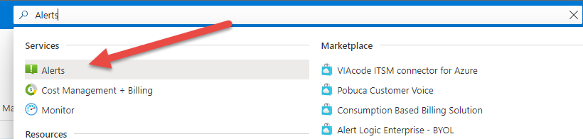

1. Click on + New alert rule

    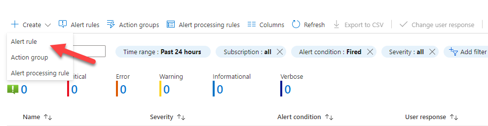

1. Click on + Select Scope

    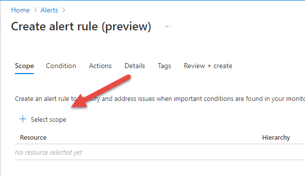

1. Filter by App Service plans and select the asp-opex-1 item then click Done.

   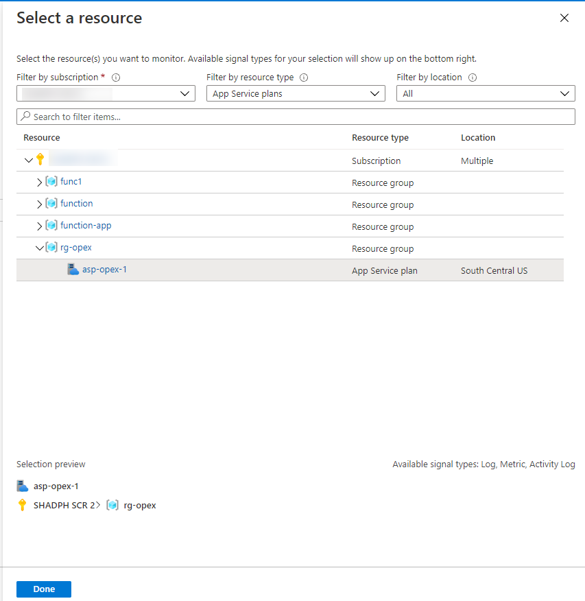

1. Click on Next: Condition >  Then select the CPU Percentage signal

   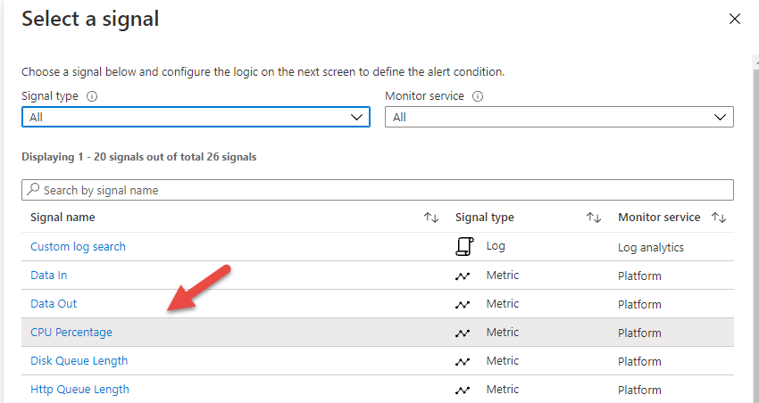

1. Configure the signal logic, for the lab utilize the graph to make a decision as to when this might trigger. In this scenario, my utilization is pretty low, so I will set it to 2

   

1. Click on Next: Action > + Create action group

   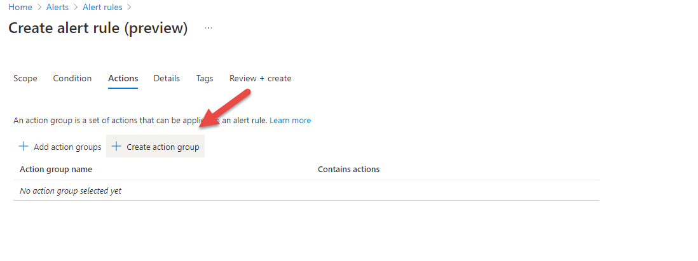

1. Create the action group. Save it in rg-opex resource group and name it agEmail

    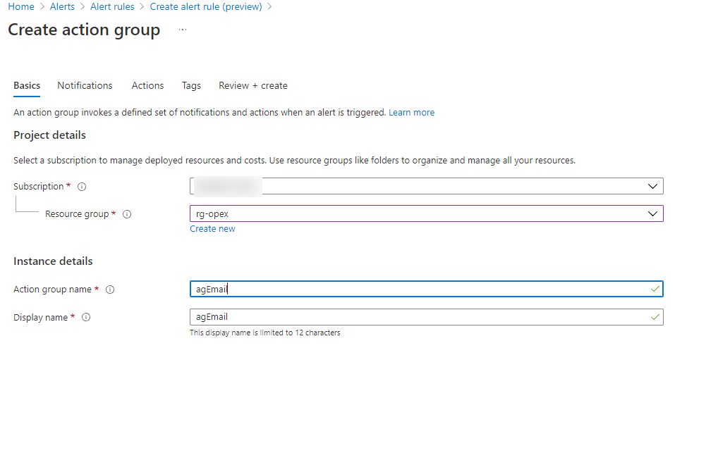

1. Click on Next: Notifications >
    * Choose: Email/SMS message/Push/Voice
    * Name: EmailMe
    * Email: [ Use your email address ]

    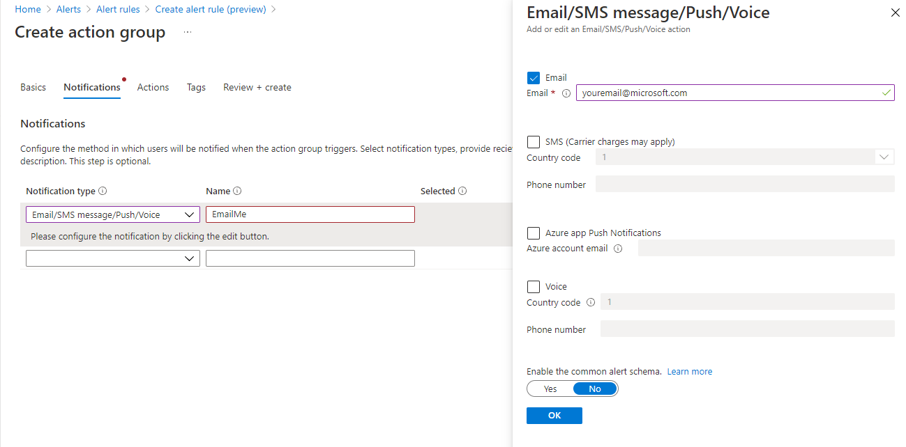

1. Click on Next: Actions >. We won't add any specific actions right so.
1. Click Review + Create.
1. Click Create to finish the action group creation.
1. Click on Next: Details > Setting the following
    * Subscription: Choose your subscription
    * Resource group: rg-opex
    * Severity: Informational
    * Alert rule name: Alert CPU
    * Alert description: CPU Alert
    * Enable upon creation: On
    * Automatically resolve alerts: On

        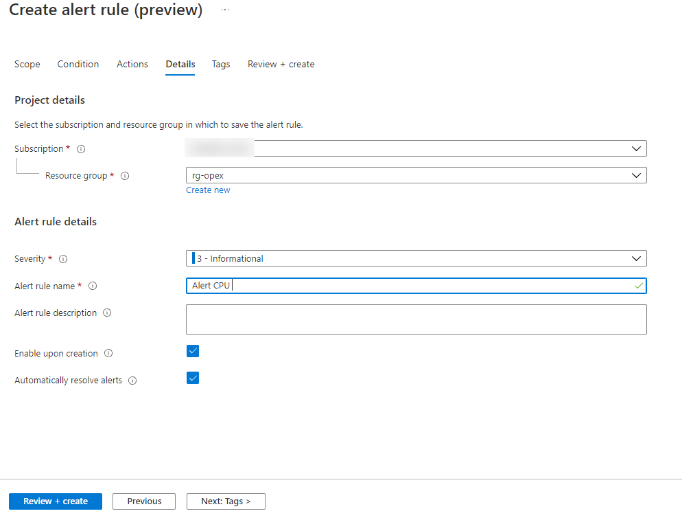

1. Click on Review + create. Then Create.

### Autoscaling
1. Navigate to https://portal.azure.com .
1. Ensure you are in your subscription.
1. Navigate or search for Monitor anc click on it.

    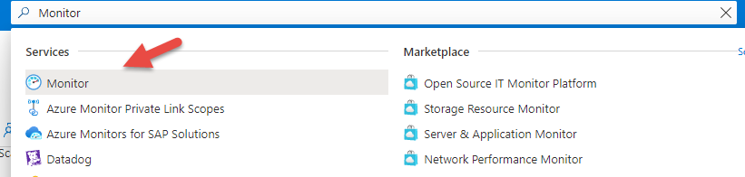

1. In the Settings Section click on Autoscale

    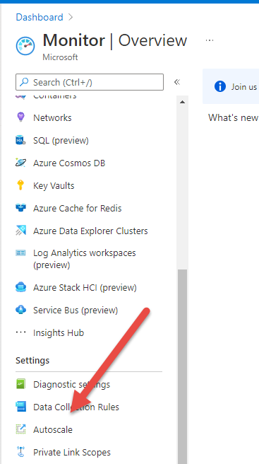

1. Click on the rg-opex App Service Plan deployed previously.

    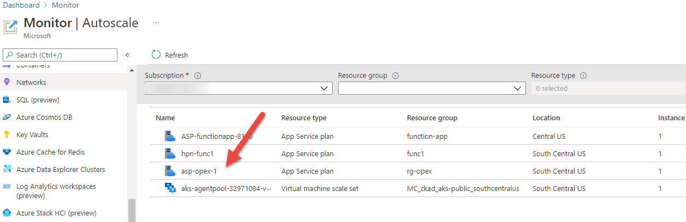

1. Click on Custom autoscale.

    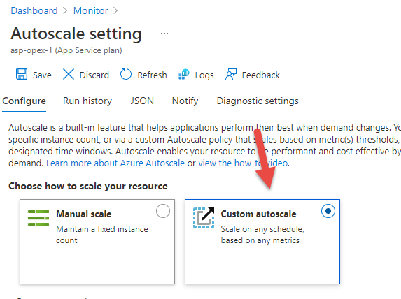

1. Set the following Values
   1. Scale mode: Scale based on a metric
   2. Rules: + Add Rule

      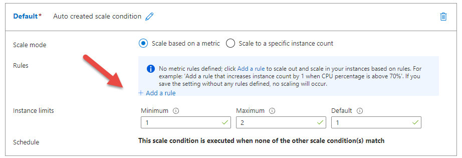

      * Metric Source: Current Resource (asp-opex-1)
      * Time aggregation: Average
      * Metric namespace: App Service plans standard metrics
      * Metric name: CPU Percentage
      * Dimension Name: Insance
      * Operator: =
      * Dimension Values: All Values
      * Operator: Greater than
      *  Metric threshold to trigger scale action: 4  (Set this value below the CpuPercentage in the screen, just to trigger an autoscale. This is just for demonstration purposes, you should carefully evaluate what the actual threshold should be)
      * Duration (minutes): 5
      * Time grain (minutes): 1
      * Time grain statistic: Average
      * Operation: Increase count by
      * Instance count: 1
      * Cool down (minutes): 5

            
   1. Instance Limits  Minimum: 1
   1. Instance Limits  Maximum: 1
   1. Instance Limits  Default: 1

        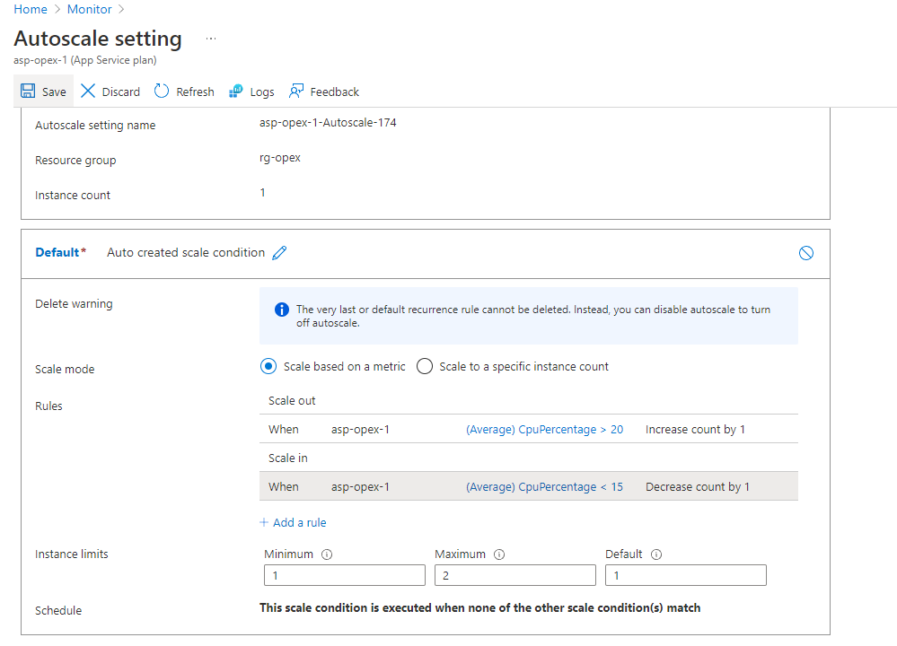

    1. Click Save

        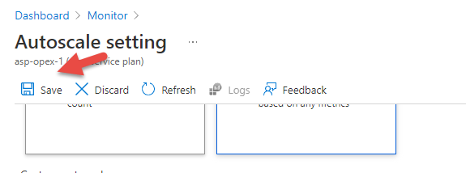

## Query Logs
1. Navigate to https://portal.azure.com
2. Ensure you are in your subscription
3. Navigate to the rg-opex resource group
4. Click on your App Service Web Item Item
5. In the Monitoring Section click on Logs

    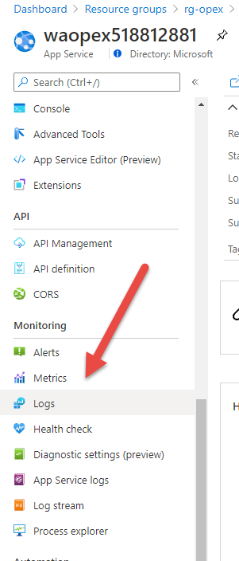

6. Close the 'Queries' dialog window.

    

7. Enter the following KQL in the query text box and click Run. Then above the results click on Chart.
    ```kql
        // Response times of requests
        // Avg & 90, 95 and 99 percentile response times (in milliseconds) per App CsHost
        AppServiceHTTPLogs
        | summarize avg(TimeTaken), percentiles(TimeTaken, 90, 95, 99) by CsHost
    ```

    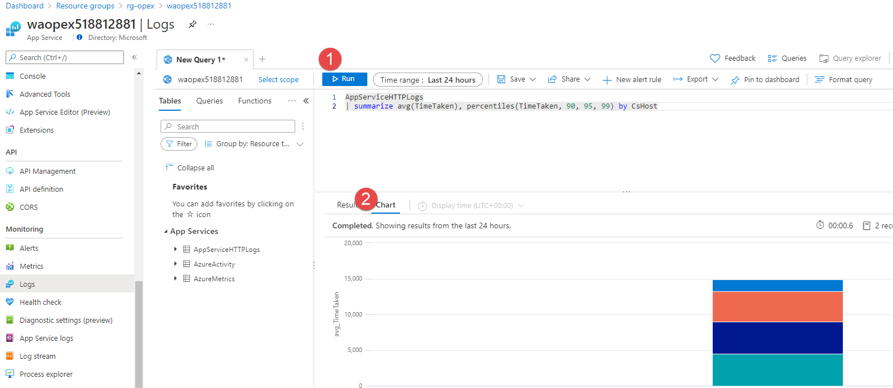

8. To Do:

    TODO:
    * Wire up Get GitHub (clone|deployment) - Maybe
    * Add App Insights
    * Add a problem - maybe
    * Add as many diagnostics to each service
    * Gen load with command shell do while(true)
    * Add Alerts
    * Add Queries
    ```

## Reference
https://docs.microsoft.com/en-us/cli/azure/monitor/log-analytics/cluster?view=azure-cli-latest#az_monitor_log_analytics_cluster_create

https://docs.microsoft.com/en-us/azure/virtual-machines/extensions/oms-linux#azure-cli-deployment

https://docs.microsoft.com/en-us/cli/azure/monitor/log-analytics/workspace?view=azure-cli-latest#az_monitor_log_analytics_workspace_get_shared_keys

https://docs.microsoft.com/en-us/azure/azure-monitor/vm/monitor-vm-azure#collect-platform-metrics-and-activity-log

https://docs.microsoft.com/en-us/azure/virtual-machines/extensions/diagnostics-linux?toc=%2Fazure%2Fazure-monitor%2Ftoc.json&tabs=azcli

## Web Apps & App Service Plans
https://docs.microsoft.com/en-us/cli/azure/webapp?view=azure-cli-latest#az_webapp_create

https://docs.microsoft.com/en-us/cli/azure/appservice/plan?view=azure-cli-latest#az_appservice_plan_create

https://docs.microsoft.com/en-us/azure/app-service/quickstart-dotnetcore?tabs=netcore31&pivots=development-environment-cli#publish-your-web-app

https://docs.microsoft.com/en-us/azure/azure-monitor/app/create-workspace-resource

https://docs.microsoft.com/en-us/azure/app-service/scripts/cli-deploy-github?toc=/cli/azure/toc.json

https://docs.microsoft.com/en-us/azure/app-service/tutorial-troubleshoot-monitor#create-azure-resources

https://docs.microsoft.com/en-us/cli/azure/monitor/app-insights/component?view=azure-cli-latest#az_monitor_app_insights_component_connect_webapp

https://docs.microsoft.com/en-us/cli/azure/monitor/app-insights/component?view=azure-cli-latest#az_monitor_app_insights_component_create