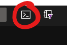
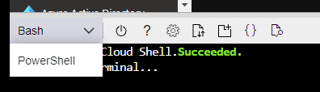
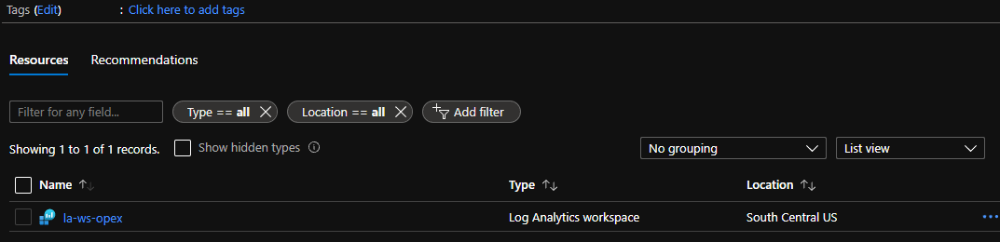

# CSA Boot Camp WAF - Operational Excellence Hands On Activity

## The goal of this activity to give you some hands on experience with one of the pillars of Operational Excellence. Operational Excellence is a large topic and there is more than we can cover in a 25 minute hands on lab. So, we'll setup this lab with progressive objectives that can be completed at a later time.

## Objectives
* Deploy Azure Monitor Log Analytics Workspace
* Deploy Azure Linux
* Configure Diagnostics
* Configure Azure Alert based on VM Metric
* Configure Autoscaling

https://portal.azure.com/?feature.customportal=false

## Prerequisites
1. .NET Core SDK - https://dotnet.microsoft.com/download/dotnet-core/3.1
2. 

## Deploy Azure Monitor Log Analytics Workspace
1. Navigate to the Azure Portal https://portal.azure.com
1. Click on the Cloud Shell. You may be prompted to create a storage account if this is your first time to use the cloud shell.
   
1. Ensure that you use Bash for the Cloud Shell
    
1. Set the context to the subscription you want to use.
    ```cli
    az account set --subscription "<your subscription name or Id>"
1. Type the following command in the cloud shell, make sure to use your <resource group name> and <cluster name>

    ```cli
    az group create --name rg-opex --location southcentralus
    ```

    ```cli
    az monitor log-analytics workspace create -g rg-opex -n la-ws-opex
    ```
1. Navigate to the portal to verify the Log Analytics Workspace has been deployed.

    
1. Run the following commands to get the WorkspaceId and the Workspace Key, alternatively you can get them from the Portal as well.
    ```cli
    az monitor log-analytics workspace show -g rg-opex --workspace-name la-ws-opex --query customerId
    ```
    ```cli
    az monitor log-analytics workspace get-shared-keys -g rg-opex --workspace-name la-ws-opex
    ```
## Option 1: Deploy a VM
1. Deploy a Linux VM to Azure in the Cloud Shell. You should be prompted to create a password. After it is created assign a managed identity.
    ```cli
    az vm create \
    --resource-group rg-opex \
    --name myLinuxVM \
    --image UbuntuLTS \
    --admin-username azureuser \
    --generate-ssh-keys \
    --assign-identity
    ```

    ```cli
    az vm identity show -g rg-opex -n myLinuxVM
    ```

1. Connect the VM to the Log Analytics Workspace. Make sure to replace "myWorkspaceKey" and "myWorkspaceId" with your specific values.
    ```cli
    az vm extension set \
    --resource-group rg-opex \
    --vm-name myLinuxVM \
    --name OmsAgentForLinux \
    --publisher Microsoft.EnterpriseCloud.Monitoring \
    --protected-settings '{"workspaceKey":"<myWorkspaceKey>"}' \
    --settings '{"workspaceId":"<myWorkspaceId>"}'
1. Create a storage account for the VM Diagnostics
    ```cli
    let randomNum=$RANDOM*$RANDOM
    ```
    ```cli
    stgName=diagopex$randomNum
    ```
    ```cli
    az storage account create -n $stgName -g rg-opex -l southcentralus --sku Standard_LRS
    ```
1. Collect platform metrics and Activity log by setting and creating the diagnostics.
    ```cli
    az monitor diagnostic-settings create --name VM-Diagnostics --resource-group rg-opex --resource "myLinuxVM" --resource-type 'Microsoft.Compute/virtualMachines' --metrics '[{"category": "AllMetrics","enabled": true}]' --workspace "la-ws-opex"
## Option 2: Deploy a Web App
1. Deploy an App Service Plan
    ```cli
    az appservice plan create -g rg-opex -n asp-opex-1 --location southcentralus
    ```
    ```cli
    let randomNum=$RANDOM*$RANDOM
    ```
    ```cli
    webAppName=waopex$randomNum
    ```
    ```cli
    az webapp create -g rg-opex -p asp-opex-1 -n $webAppName --runtime "dotnetcore|3.1" --deployment-local-git
    ```
2. Create Diagnostic Settings for the Web app
    ```cli
    $wsID = az monitor log-analytics workspace show --workspace-name la-ws-opex -g rg-opex --query id
    ```
    ```cli
    az monitor diagnostic-settings create --resource $webAppName -n diagWebApp --workspace $wsID \
    --logs '[{"category": "AppServiceHTTPLogs","enabled": true,"retentionPolicy": {"enabled": false,"days": 0}}, \
             {"category": "AppServiceConsoleLogs","enabled": true,"retentionPolicy": {"enabled": false,"days": 0}}]' \
    --metrics '[{"category": "AllMetrics","enabled": true,"retentionPolicy": {"enabled": false,"days": 0}}]'
    ```
## Reference
https://docs.microsoft.com/en-us/cli/azure/monitor/log-analytics/cluster?view=azure-cli-latest#az_monitor_log_analytics_cluster_create

https://docs.microsoft.com/en-us/azure/virtual-machines/extensions/oms-linux#azure-cli-deployment

https://docs.microsoft.com/en-us/cli/azure/monitor/log-analytics/workspace?view=azure-cli-latest#az_monitor_log_analytics_workspace_get_shared_keys

https://docs.microsoft.com/en-us/azure/azure-monitor/vm/monitor-vm-azure#collect-platform-metrics-and-activity-log

https://docs.microsoft.com/en-us/azure/virtual-machines/extensions/diagnostics-linux?toc=%2Fazure%2Fazure-monitor%2Ftoc.json&tabs=azcli

## Web Apps & App Service Plans
https://docs.microsoft.com/en-us/cli/azure/webapp?view=azure-cli-latest#az_webapp_create

https://docs.microsoft.com/en-us/cli/azure/appservice/plan?view=azure-cli-latest#az_appservice_plan_create

https://docs.microsoft.com/en-us/azure/app-service/quickstart-dotnetcore?tabs=netcore31&pivots=development-environment-cli#publish-your-web-app