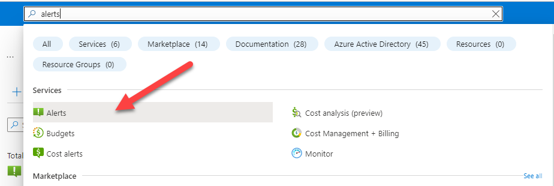
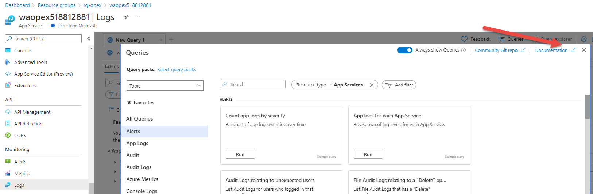

# CSA Boot Camp WAF - Operational Excellence Hands On Activity

The goal of this activity to give you some hands on experience with one of the principles of Operational Excellence. The focus of this lab is to introduce you to Monitoring, Autoscaling, and Alerting.
# Architecture
<div class="mxgraph" style="max-width:100%;border:1px solid transparent;" data-mxgraph="{&quot;highlight&quot;:&quot;#0000ff&quot;,&quot;nav&quot;:true,&quot;resize&quot;:true,&quot;toolbar&quot;:&quot;zoom layers tags lightbox&quot;,&quot;edit&quot;:&quot;_blank&quot;,&quot;xml&quot;:&quot;&lt;mxfile host=\&quot;app.diagrams.net\&quot; modified=\&quot;2021-10-20T18:36:32.048Z\&quot; agent=\&quot;5.0 (Windows NT 10.0; Win64; x64) AppleWebKit/537.36 (KHTML, like Gecko) Chrome/94.0.4606.81 Safari/537.36 Edg/94.0.992.50\&quot; etag=\&quot;7SpvEarmyNzuUHp1uce3\&quot; version=\&quot;15.5.6\&quot; type=\&quot;github\&quot;&gt;&lt;diagram id=\&quot;L9h7rcnGL-ruhj4N0t8O\&quot; name=\&quot;Page-1\&quot;&gt;7T1pe6LI1r+mP948rEn8qGIMGcFWIQa/zKNoo4jLG00Qfv17lkLBJTGdpNMz03PvTBQLqDprnbW+qdXZpv7YX46txXAUfVOk4eabanxTFPlaUb7h/6VhwleudI0vBI+TIV+Sdhc6k3Qk7syuPk2Go5W4xpfWi0W0niyLF/3FfD7y14Vr/cfHRVwc9mMRDQsXlv1gVJgGXuj4/Wh0MKw7Ga7HfPVaz42+HU2CcfZmWRK/zPrZYHFhNe4PF3Huklr7plYfF4s1f5ptqqMIgVeEy82JX7cTexzN1+fcYN3/r9ov31bSv+T+87ilrT3r9n/yFT/muR89iRWL2a6TDATxeLIedZZ9H7/HgOZvamW8nkXwTYaP/dWSAf9jshnBuyo/JlFUXUSLR7g2X8zhrsqwvxrjb3TDav24mI6yEd8UVZKubm5utr9kcAYIVcTsRo/r0ebkuuUtNIEMR4vZaP2YwBBxg3rNd2QEqFzol3wl3iH08lqse5xD5vZiXxBRsH34Ds7wQYD6ONjb4+fRQuoqN/83+r9Av11XY+3ufxl156A8GgLdia+Lx/V4ESzm/ai2u1p5XDzNhwRFCb7txjQWi6UAbTharxPBRP2n9aKIqROQg2ksnh790UvzFZzXfwxG6xfGCXjhWl5EzeMo6q8nz0Ue+3goX/07oXz1e0H5+t8JZfk3I+YDQd0dDeBCebk8gD+omiV+nMxIu1VQfk5ApzX6g1H0fbGarCeLOfw+WKzXixkMiPCHSt+fBoSYnGz+Qf/knlGOJgHeu0ZEHQp/emU5uyplV+DzsL/uf1PL/FW5WT0H35TKBhCqVL/f2kovqWiD7ubJT5dTL5Um/du25BuL54Zakf1Z/DRQ7+YNpR02lPtVrytHg3k7baS1J6tzPTFvx+tBXU+bMzv83rlbDG/bcXNy/eypd5H30F4OZ/fhQJHXA0VPG7NS0ktKT35i7e6b3017Yf6dQ3WY6KqV6M/+zH+2nKne7FzH1uQa7pKTXt1b+2r0NKzfaI2unpqJGYzq8mowty59tTfPzwGepDbmvngv3G+U44aK693eUzJnY2l4W75sJCUY7T8NU4vXm5oxjH/GZ5qTLXzSgdJe+vXStO/k52w/9+pRjL815vbz8OEu7HV7MP9h1Jjp0bBaqt3XWs++Avc9VGDsdG1V9emw3srBL3rqq3boPVSigzXkfstg6AEefGBLT7lPG8rud5ir0nu4S/vd0tP3jrlphLWJWY+m8Mx0OPMVy7ESC9bf7+qPvmKP/bp7CThKfCV6HgAerKqmWxMtNatBYhtl2XZaSqNaBtjVtIZTThtObfNXxwxya7ns1UvhYHaz7gFMvIcl0Mz9D4BRAjhaPajDyItKYx92PwAbhr0B77mtaDBXHeYY+7cBwKG37D0MqwM1KJlhObCqZdnqaLEVTlPL8QPbAXozTIaXsUz9+k2I7/Nv7yJfuU+GMxd+Gy57t+0FPDN3rwfrH0f97nAxhPdmz/kebta9h/a4V7+RvE5l2YPfBt17yeu2x8N6bQP3yXbHBD75fosUuuy0ax5+q9thMxoCbleBP2vPmrObyUC9l+Cd+Ezgn+UM6GftPbRgdL8rj3uKS1T0l4ozjwFi1mUPsDjo3kjiDmmEmOP3JL0HQUHOS5zYDgfdiO5ryLbU725WHX7XpJFq1/iOYT2SBnX3+XsYP3uKdXmvlJI+/NZQC+uplnZwcPDO+5mfMDzoc1rb2KGbmhPQNZW7ia15zuq6N4tWw/p9IihrBu+XgOp+AF/vRt19r/eitnIj+6q99Lp6dXC7u6PnDsfDBxvo9OapNdvIfuhtAF8K0EQ6rLdrvYfeEuXHQNGAHkxc1cxUx+NmChAUb/8+8cJRvXYFMmzLf82ZPgY8ToezKBomFcANrBagOVA2zz7Qt5l6CnCKYk/MwENegucMiI8AmgBxC2gbni81AJrAv8vBRIZntKWBIiFdAi31lsOqDPi9m/e7GvDu/Qzpyqoe3JdkNHfkN2mglsXzhjAOn7+J/NnNk6e4cL0WAxzmw24Ec28/wzsSgB9RhOWUM34mGdAjvmG+Bnot8LWnAl/P7p9gvivvIYpw/UiJdlhLrdDC52zlBshvDWh4bRsu8EdZagK/wxyWg9kaIHYT95xlSPBJp0+2MY3t0Nr/Pfa6w6gAy2pxPsCzc6DuBfDY8xD0DMygKIdAjoEsURvdHb/Cejf2vrzajpPHo3q07j8sI6RXq3Ni3MNWLmyajhnvzVuFe6YD1V+jXGo4QREuc8DXDOabyCir1s29NY1mpecBrNWuaqlleHLTsCR4/rM3W0aeehSvBCdPKa0GqlkyJ/asR/8DOXVrLwbqcO7PmEe87ibtdQocVS3lNNAyTwG7UYJPNjHwz0LQCn0mvBvTfbw/D0BHwVyf/YkcguRRYCxIG5fp89aWRt1NJLh81ZxYcrNrSj16Tgv0pxTYBsrUmmQ7ptIwWnIj9BWzbgUNp/Vkh+bKSjTZSsprwCWM81d2R0vsCX53gZZ23+1EU5rVODar0oauJfEa7pXsDowN4d7Q15u0H4jFs2rwjuDJdvwV6iXQdTrcqzRC1FkS3K9tmtWyBPOR6D5nCuMsnp/Bc4PvcL8b8PMC+A70H+J3nNvuO84N5hObRg3ux3XCfQaMo3kFq2w+zaomw7gN6B98N84lbRimKuaGc8F7cQ6yebvYybUkk2UV0D8B0BjAdk6fkbcPeADo52kAe6sh6NlG15b9eW88BPnaE3znq20dpD/gp7cc1ONLU2Eq6wHPka7rlFMb9LyVtmQr9FYge5+aThB4SRngGMgwZ1hfLUA8ALwTvGYa/hOurRGWE9OA9ToIP1z3FPS1BvszwAv+7cA+K7RSwAH+3Zj0LHhHR4N9HeKjpuLzm4aPz99YSZw2UMcYDEt8pp228JkS0MMa7kMagGd5GuJVwBLnseF3AD7puqU36HqwYVhbKnyHZ7dovqDHkE7g2SY9264SfakW0mJVU22gK1pvtYzvVPldpniWn/B3X4XvgM+yxu9qbfjdHjzbfLJSpHukHXyXy/Rp4G8+wHcaNDtaKt4TAyw2NsAMZAfAuPAZ3w80xGun+QGu8Hf4qxDvMK/Q/Gm+iabjc2EditXZ8RrB0mnBPGo4ZxXpFvbUwaBKa44tvgf+VoAnyoh/epeV0LsARmWck2qJOQs+3SCu4a9mJzxXmBviWmVYmHoD4A2yMED+stIAcZ/CPAFevka4d8wAngs8EgMvBKppeDB+umoiHqqAa4P5ScwxRlwTfRggT/AawwTkBtKjqwoc0frsMAgQ3kCXK6DxDckekM/0TMA9wyTA5yg2w0Hj+U9lpitLY7oydV5PIInvJNMsliUoh3JjLKRFmMNU4+81pH8Nvgta9VEmoVyISZ51iI/E+6YSwsQiegFeSV2UmamYt8K86PO8Ux/XhOtn+jdqCHe6z0Iem2gCBzW4z4N18noBliumPeQj2MsTr1kI3xTlGtCxTDwCspTg0qF368AjKa8bZHzq4bsz+pRg/bg+ifm2hffhnBEmEj4faAWfS+9CfMM9YHsIfOGaUpqvBs8DuJkgc1okS2i+TkD81NzRwBreDTRONJST5yj3PaANmB/hsKyzvKntZBPoH8EbIJtJjigNXivOKYU1ou6Q8T7kGeR9oAuAoYufdaBbmejKsVAPSLAG0ikm0UQtaeC7Q5JXG5aVLskbnB++u8lzTgjHIdG9btE4T0KZCvJ9xbAmeClCbiom85CQh0FgsaxE2CcwFvAyVZnPApoXr6MMz6zFgjZgPTSvFGnV5PcTXG2GSyJkTmwxH8uCj1PWoybPi3S3iXqS5tI0PIEjV8ytxrRptFi+Mk/pJFsmglc7IJdYfm1QPtlVehd+R5wgblX6jrKkw7zN8pV5Duw2njeP1XAPgM9oMp2ynqiSjGG6ZXyrNr87bXbEs0kGwR5FyCmkG9gXCT3P/CBkm0p0nbBOaxLfuEIuuDrjZirgAbjZyeeE9hZEvxbQgBfYJLNJfmbzi5tC7orvJPv5L31PxPwTpomyzvIwCMRYpDuF+c5d8bit/E6Zv1HGtvDdCGfcb4B+nRLPNVFHJ0LukRzydaZlpFGL9gHMK3ifpxT2KWB/kZ8lQCcV/v+0P/AgdnAyUCDL0oWU+0eWC4EDpVS60A8CB7p8GDfQP8AHeDRacyQ488tcrXtu0J/zvSrn+l61r3S1KgeuVnKySp3R4/ME1qdI36P+/N/mdQ0LXlewM3rdG6n/0EMrcT3ooseUvaGDOcjvyUd4az/M25jNBT2zL3hTa6itn2H39gwrWKPnrPFg6zC38agq73mEd96c/NxyHscn+AxrtSP0o/UUFy0hqSG13XbePu6ARJu1pV71l3qItQFa1+lrHu0Sj4P3FLyvoKHQO4EWGnlqjGkMO4A9j0Qv8ue28IzRzgq0VHkBO5AYNLQE0h6tUthZS6DVccc5RSs+5yFrP3sKesnQOryJ/ZtS2gOrv9+1owe1svK6+ls9tYnNmjVhay5vfd4D7dyteh154nXtx5569zzs6tMmesVhJ4YaCzQY7CRa4q91xbCML5neXLSC0ScKa+5FZphpoc0pP8jWq7fzsFjs8QvRE3wHOGhH/qwUw3yWw9spemUOvHrwDAks6zWuGeYz6z+0gA9vgNaip0Z3E/XmraPeQH8Wzfu3x3+D58XieeThge8rgPt4AHSMninyEqr3S5j7Ma8Re6jRy95tA67uVaYNd9+bI/vzO+B5mG/9Ru89wPoRl2lLh91DeuDRIw8bWh6eBFaqctTjh7svY5raYPH+8fjtPH4AM/RWyAAf7Ys9fte9zGPPeEYZIuEcfAWjUBLQQBs9yCnQhNTrBDHvYsuxbbiSZbjLLV/F02sRNxAeqPZyWN9ESGtg/U2+RxWMMYA1ED+LcQV/v893zYbJQL2Hp/uwz5XOmU2Ke9ym4ad/FVZfdTagB9sgP3h94p1g/ZVhJ40jWw+V2Lwh6bAEiAd+fTMGqX3dUHnmWYyg2ppuoeQrY8SkBHZLDDYFYIHnQ1EZwOzwFrhybq+8h3b0l1EWdmRZsVMT7IrpJPfMu++3/B7hZ+XZOoiFVmyGutOv30dD9DXBuwCX4vcttHGFh35a9K9jrOt9ftq07dg3luSiRMVn2xbZ8lPZS9lmEraexjYM2e9gDyBlBFLfqKXk56uWA7NaCWk8+gmM7dgUfbXkG6FrbQXsJ5AUbRhL/gSV4Jb6/NyqlB9r0jXX4vcbpga2GPpnVlboo30J98Tov02b9x7NeTQxn/O4bCh+kU7mWZSzX0ceb6mWUwMLEfQrY5OicoghpsTNeFh3F+RBMlpknYFeRs+g0jwfw/Iehjdvw7D/Xgxv2s7NjeXmMYweuRj1sNTsWoittbgWM5bJuwG/I1bBWkzLbD0KzAL0V4w9U/Xxtw55dRFzKns57kL0cCOmin8r6daLRhj2yEthzSx6Lz+XPGiqmFNiq/gbPtMVHjiy9uWM4th6RutWIgqg+9jLGXfoHcPLQlQSIB0/99Id5LfyaA4aCCAMEN9YE0l5RR4lQLu6DfyO/odmR9NQI+3JpdZpOWk7ZZCT9qLXhT1piHRoHpNGd0c8/SjX5H0d+WZPv2RqbaOVWuGKIzRTgLthKgDDVHC+wpzragz/gGmC4a/lOF4hDyfhnTxUyvYzesnrRF/oqWfPGnmfrPXOy2cbeB3elbDHAZ+FkRBPZU73AL/2z+AwkbTXcWjSjqbBsaTYDg90y4s4dPdweFSjnMThu6M1KfE18HcOh8SDpozUyXybXdvyeIF/Mj4mWBd4HCwYwpWZMK+yTABe1cjjWY2Lf29RSgeKeE7Gp4mgpSSTLXke99MyeylZmyiCz0nmmHVry8eHPF5hzaDmPE5IBdXS/BVNLsE74rdwNtksgKs3UEW4z9mtt1CF8oezX+NsoJcNQul8nY1e57JqJ+fqbG9fZ8tv0tnh5+ps6wWd3awWdTZhWkRMBa9rmc62Czq79yadbW91dpDxs5bp7OZtprODvM7WPldn41vO2MkBj7XiHVWAdXz2Ts7f36srb6KK9L17dbvarLUkKzXze/UE412WwtiwCRvIcwxxxixjLEcZMG66EtI95Rhc9hnHj4VW8CURF6a4LGOUeD9tpSI2GgZCNtA+XGHtwbLmZ/bi/poy8V60tCiyChLsbKwhLxuDeknuVcuhHR6zSXF+Pkj/flVoDPxs0N3qvrdjoOhPva4tgZW+xtyp4exGAtxFwmuTDm+jFcpmzD8bGIvQdqKqXWvpzYRzKhzHjEUsF2PaksdaMGUuqSUcdwsori4+7zQixYKEJnU8wXkWaGiS18gDKNcV5vgW5wcQl5sS5zT0QuY6b00xVYrfuXLD8TB2vKY4UNcSv+F73Ew/oG2mcLy4RXHm3JykJsc4FZJEjitiUpT3kLKUaIdiLThn1Isr2GPTXxvvv8U1tDjPB77z5+ECvUpWOjbQ6mpm9IaSgzyaLbIDMb9k991Fu/Fl6VGkxP1v6NdNtQ+MWRWDVLKE5S25IJZyGLGSjkSspE+KWH1locuHRKzUMyNWvypgdRzKh8UB/xGwX34p2L8EygDLx+RB3E9fvPwXY1P4luS/fR89TmDpo0dx8QsQpn8pwtT/CFvIpa+Mn6sH0shazCfrxeOfkPmfkPl/I2TuoGt9+pkh80s0Ch4UGYw8MDfUOzAi/KdsTbswOYaWK/EIDVcsRpHunincWsWwt6XC5nyz/Zs3Lrr62Jttokb3DmhnPfdnJXkwa10CvlQKl1fLqY0J9R3xF12ELxRF/SmS2QZMZXKvn1skc4yOuEgGnV5grAcSpxQUftcp5NzBxHoMz+/TIYZP758RT2DG6sKwPAipo1sTw9j4rlOh6379ftlTxhKlDhi1fWN2O27QvdH6XXk5mt1PceypcUMFUxIwpaOmWwTzoyFx7VhIfBd2B5qfSPtpApcDhVIpMPlZbYLZznAtTfro/Lw9grtbgtOOHnPFCwCb56GC9ICB5t54cGtH+fB1vhizQOfbBMate0Lg2H/ZLcGJkVLTwFB/VpzgppZTS0B+vB46dwLdfnvo3PHR9H4tdE6uHdvI0lnd2A4D5awQugy0qWYhdCzZdAMHtCaMhPcANtOjzpSda4fkkm+4mIayLpb9nXShAySaRnnyfeanTaMmnXCx7TmP4A0OOhFfcf+R49GSRIpxbKVWYu85kl6AhMYrYOeQpQJ+jzr2jzoAaVWt9zoA6+1pD/71dg7ACRamUAhG9xIsJHBlctN20BlKxSoaOYQcDNRjwQ4WeNQ2Zs4ZyAn6eB8WSXkrSuXB4gIsjnBqK4KacU/uYQ7VTLMx6yYnaG+shJICNlT00WWnkE2OnppMjh/HwmRp3Z5I6PRi56vTMyx0KiaxTkU7hi/m0tIpyT+lQg85m2srtSjRnd3SFoWS8DPcn3BSMs4/2nf+HLoeD0NDMqxl03DcV1yP6Fzy1SYXkqHjDHi7kBbzClX7k+8c6Ent1FePUvZRR6SrNeH+dzsiYcfWcspxU6FA0XqnqxeYiLGlKcBnik64ATkKfZmKczKHX7ViiABSSgUTCTn+NoAPZRtGTKcw/gYdeSKhw90IJ6dIJmltuGiDHIugB4lONg4mdKRAV7fFsN5pmEz39dQbYbJ8gvHRzjEr3l/ngimgZ0xuUcnZjU7QFIs7fErAtzoxFsaJcKmlU+GRoNMB0C7wOgXFKFSDjldKVoH9QIcKhdgx70yxOAGeVXCU74cxD4Mdji9bk1eD2xsqvHJckvpYIAl0exjGPOE4J+hKZqiT9LJSpPoTjvNjgUyUlrr93kBmOqy3pjWwBdYk/xrdbTrmJYaVdnhrUXEG7LVAuo+xmCYGuiTa3ckOlwpPCIchF0Bh0RI6ugUOEyzKGlDBT41pt25xEQjSdDYOaRdlExVE1HTHKLz7UPachM7+7uit0BnMSk+9XeBfwvImWIXGqyCOFVTMEDBrWE7akmBMyqVNWFqFEDE5eMjQ0Jt1Cg3TKpuYpkVllRTWEeOQirG0qSa49yeol6ynl3V1EwPvhq9TeW+IoQP3fOrVwX7c5KhXO76fOokfkJL77S8+mHqVHfX6WH4HePCIejnkhklpVDaZ4U7iMA9Sqauj9GgaLlEzhT0Ad3YHtGs3ZolN+O+F1N4ioRLYlMrKUgrP465ASHYsZRtaZCFOSKLpzfOkL0JY/ljp+9Vw8Ivr3gs5H99zgpR3Wq/sGjwsRxW7BkxbLKv76aEn95yorav5PSfsf96w55zGwsZ9TyqC2p7eVQDbV4S1qry1S5tU1L5LUWB9D1IE0wprJFM3XNiaCzyjBAHZy5gzVzYXBaec9InFuHcsvycsv70Ma9SQRWCNC2lTUczKUu7e4/eeTb21fZv5ndTb4oTXFHX92LIYDjqlV2KSK0pbSooJgHpdDt4mBC91l0CLewdrt6YurXdHuRTAbYnCa4RBWaHGBKn7E5SLNuYrNi0XDcsw9sw9LtKbm9vjBsfTZk7j5N3B9pZTqVhuLckF23GfjvDHVHbFo/2qm2KxKOxw1kRrVUlnG8nj4DUXkOYD3KrYx1LCFEolLrzP6BCvDbmolZsgpJxkQUlTqUi5SzhZiva8arPDCRceSDs7tZAPUqYFstFkKgxHmkH7KyQpF+zSZ/A6FQ3D/hOD8rD/RJpKPWFXtfB5mkc04sucDDDFwlLUvDE1VnACoDOXEg+s6W4P6+HeHewumxO3E5HYRQ0aYD5YuJ40nGnRHghBwqG9iAlduM+lxC4Mylu85wo9LhhHeWH0ftY+QxtWP7tkIX0DzWLC3o5m32KXAc0e+N4+gGbRjrXIFrEcO6TkDMZfCraSyok5RCMaN5MAPBKNbHES2pykr6BsaVCSPibw+2zfEx4ovVKxFCq0p4QPS7HAnqedJD5fw/0tNxoAuhKJGrAnpiQR8jlgckiK/oEpNRzAphNY2E7F/9Ut/+xSSJFmudAY5WDKRcR0TWp2c/OQrI1IPkRtrgD9MX8aqP2nwk+xhc/P0hPwgHl+Ccyb6KkgA/U30tO7ZSD7iHr143b+LnlM+E5SskFz8s4mPKKfBmQC0gzqHMS1E3CDEZB7lBCkID4CSh6ihhvcxAP9PIjjhBoykB3mpQMsoGfbNyU/Fdls+NyA7GCyxyZSArjGpCBpu2cg+eaib4foH+2uJu4ByOfj6ZxsZmoexuFEIwLRXEHhPYaFclJca+n5ebSwsIeegZYR0DwWvgsfAKYnFuCzl2p8no4FeGEDrRd1rIn7HJ2bJgC/hdPN+T4lLLfKy67p8dKSk7RmvVt2bX1KW9llcYMRsCrtkPdBQE9Sjr7QT56KxGFKJmRb2qNGFJSYCDKiCVYYFnu1QD8KywQbDSD/b1gOWNykZveun5UDKOPkV30pSPeOu6GUcJKtZ+/gU24QuN3BnygSOLmDT9+bTGzX2myv5ZOJsS0LaHjQKLzD0Th1ELmZkom5bQ5Lv4Q8gJ08BtGDh7t5wXE0zpMJg45HKeY27XxdLWsrI9qSxNQupEOtVuBzb0Ee4BkVD4ix1E5F4V2HlzBV0K5Jth4sbl1EGsSTxG6Mxuc0DqVJkqfR4fZTnCaJ7S4qJrUKU6x11u4EW6hw2mJtxe0sKG2RW9M4kSH8HzA2azE0JW8PcNuqAMd9y+McCRFiy7JXd+GYdqlT6xLaoQZnSwfbKEiHN+7GW++WDu2pp7XSvHSoIQej5lex3VYH2+WkVm5nizRVo+gB48QX+EacuJyOHN4YTHMkFTTCCT3P19n7HHH6MheiMM6oLcrNAuFnuxZys8y+MpgP7bbRuwuaDrUFWQaW+H73ulT5wuRSVVELyaWaXrpQrn9ZQunpPMtCblFjEWAb5Hk/StYTf/VvyzH60wz5390MWQPNcOCt/8hmyLA/x3wVCd/vy6U1aALMa1j3urr0oNoySOzoQSmt/UTH+cD6g23OEOXZcOsNavfQmpUotwhzgECyojaNyRdu+Ck1knupbcakomL+TB8bIO/uxXYQi143a1nBz0G6gN0jtTqWI6CsKVDuWEAt1yrYS2B3hi2PkQov3Wm7Dp/BHlg+AMU8imbGY29WkjG7B/TadaHx8SxaY6YLU+AaZ36NXNWcIaXI46EhmhjfRjHsvOgd/uw+HajY2MPNU2oMFLYSlDD18F9FXvJ9JQf052pQ43exvP9eh7cITYqtkhvKtqEzt0POrSd+zrWE5nuj3twSmRr0GYve45zWLjTzrHb4b6ZRCg1a/4z9krGA4SnIo3SbF1cHW/q2HfkihzBrLv2A1J3t4p3NYcPq7fj7W+/hPgWZMR5M71bDB1NrGlNsHo6RI6Cje+BflgGcz3Vd2EWIt/9pbLNtbAPQQ+10ZmObQAeteNiqmhrJUIvexAqDg/0uSlebS+gUsGv2G+P8pxvbULvC0I9hj678Jq2sE7RNhA6iz00j0MF2FBrTR+8UtWS1M82ZkseBNeTx0r2JXW/pBc0ItrIVcmvXombECJApWr7uYuIZD/sYO85sLPxsBJqAHWpsFT203K60JbKCKZafiucdiS+7ugcWFv62y8oszCHIZX+ipy4R7VDPaSeN0kmz35mjkJ8j2X+dMq5Tp92Dwe2kge+CTrW8QX+DFeL1WnA/KSfY/pTbg6MXj2xznVoWY8tbGleWyMPn+NT6s2lYeC3mVrQ19XjbbNhhqy2xTvqM69SRL1kWoFfSynCr0xER2JqV5mu+3OZ8d6xEAdaFYyUKtHN9FgUTdQoKRuvZ21IESSfMU//CmQUvzAxLg82v4i2MJma8hR47xUrFqom3Whg1S4kOJ5/NW0dozkH6FjS3lUWYQbSlvS+AF3mDT8giD/1zydfMqxVnFRO/D0/aW8ovfwFFHZHW2E7m3fl2RWk92JPWNklrXzT/d7lxdFjDBtEbO80kskljCKrba9hM3keprjTJM1sxqaF1OmWJPan0j0L+wB9OkA/fm0W9dzTFVArIx0irLCsis1O2aJboCwyyWSrcPj5IzXrArc5h9V6Sle9TBFO0+W8lHJ0wubW94+lZK3KCTFK5fAOtYeOIEzsYmw6moBl+PnceeImRO4P93eXPNEjI5kjeA4A6xsRUwkgnVigG3KksTGMLcYwpr4T3PxAN/tdEh9zYWm0UMIW55EGQb0jxssQJtNOa41fuyo5qDsqrJc2RUuN+4jEhGRWM5HyN/KnF798tDmferBaTJcjyR6JYMnEm7gArocnxN9zl4QEwCeW0dOggFYka0IeuyJmBv9iMHQ8jwYNbqrEYi9ew8QbW1WGEoLyhyM6EGt/LLNfKATWewGgAt6uVqUk95XH7QfYOjBtmz2lQZKOMDfFpLhSt4Tms98afT4dOLdPIHIN2CA6CDtFPGain6dADHq+p3nn4JjoH/J05LzPTyBLlqZGcz3YKGI9Hq/BD5qXjIS0smVtn8kctaYqd1Z5spJo7G/O9jIyfDzSDAvPY2ErtrJ0D5b0Y3umdwzH9tcEGqR99tFJOEgD1+gllUIDthFka4ugW3UR9lLLUpOMGSA9lUpN024aOsRESE49lOZ9SW9JpinDx2B7t6/baNdk6LTG/fi+5scPMvtvxNHqAvty+2+x8J4f2nQU4yu0i3r/zcIJz8aluNSDvSPP2+i/SgEfnpW1tuiPzohZ4YSbBvwKbTcc8TWe/YB+JvrzhDP12HxP93h5BL6Lf+tXVYej78kjo+/KTupcoh301+KB6uG/+DU9/v8FDKsSlxdMaG348RaPVN+UygslVBo/wKcBP1e8u/Pi0nkSTtE/xb0Ua9Fej4Zc2tJELDW0uFP21njabyXp7H3z2ctd3t+CX/B2f2ARHP7M9i/KV3Vn0AyoqA0pWQDaTeXCA/1ezJXKIPJEVIb75AE4EemW1flxMR1laxXwxRyr6MYmiXKaFJFVqNwoOFtkbs03w2F+OL/rp0+Pooi9mPPoYVtcUvcjqJfVCP+ycdnkk0UVVP6tXkf4P71V0eSYzXH9lRyjl8oAbjsnGcgS0dJhahHAixigC8YDi9xljNhkOGV+jFbxkQM9DjC0Xk/ma1qhXvum7NK4DUlYkfzGfj/y1uBmuSYeoeoGwTvKCdCHpJX7U2SgQD/uOs88NWfz4sQLU7+No+86fl2GHWDuBoYOUrByaDoF9gLgsZ+zHYr4WPCMruTSuyQwk5k00GcB/STLhUmf9Ofw6g2f8HSwAc/P+HA+NuuEpXmCu14dILV0rblAuJelAZGlXR0TWLovv46WW9qU7iGJLvIur13YQHyjurs4Ud196stnVId/QyWbmfIX08Zvzz3IZgRRFkfx3NuGP4yZZvi5wk6ZfX+j54wAvD5hLPbb7ly90/bOU1fU/fEtwfcgjxxd69aV7gtLhnmAx/zHBNOP+HEwkyRgto0Xy79gOKCf2X+Lx/5MuVP16r8nw7749uD4Uc8PZZD4By6N/og3lcBELoA/7q/GWX3JoPMds0bSSToOjPXPpAPcn7akzjSgw78Feg+kQ2sVs942l59GoP7tYAtP3o7/7CIKPkZWXenHnoZaO7Dy0C+1QPGrXF5+19finC8esm/CrOwj1K3cQ2SxzvGVM+sF8sQKqRfcTgGsyD37vncRuxqu/swl/3E5CUfe4Q1IvtHxPdu2snYSmXkhXn8QrV/90XtH+EbxyWKz0h1dedrIrR2zYT2SOF5pnF/tXw4P/hbVlf/pX/+lffbR/tYV15eFB7lW+ji2mXi2hFfxlmHh8q4w9CE0D5oZ9CbD/h1NbYqwvl18/HSg24RRgofhy6Xkw28Dz738MZ1E67N6ssPLgQa0kA2WIdWNvPQJasqnrVjnlvjhvOwLaNlzsdRRYKR0Y+ucI6DMrZQStHFS3DB8wNqxLMM/xqHufiHrHDdCG0jysrOE8JDxs1aklQEtHe1pTdX3a2tj7vW7/6z2tMfpPWSbBb9HTmmnCf62HKPe+4gyiYte64/0uiHasNHjzEdAm1fi/2o0Hu1lxp+39XpAvzIe6IEQ9x6yVnlC29jrltXnTW/rq/Ri+X8I9LeDzOVaO+q91tM4OK0tsPOrwrI7WDOtWkj88zgLNfqKz9UHuhrg/y7DKsuAT7JtkH82xqyl2aldb1PN/m00i07GfhTwNzF8z33SEpkVdN17veHjQL+lF/Pj5AzMBsqcOzDzIuhH3T/dz8bG38PH8PueuAtC9KuSx0BGkheyfBHTT2w6vg1m7a/u1Qym5Y+L5kHHMPcgc7zh+EjKEqTxkatg3JT2W4WO5Ndkyoir26thJRDz+zS1mPfIa3ko1CtUZvtwJST3vkFXmB1fd46dThzGe4CdX3+MnzN4/RjN6K3XjphO8RjMpH3b+drrBQw/Lr/WAwRzK8+km3Kcb/210E+7TDULH0o7STdozbLA3XqUb7N3SeTt0sFe8+Qp0rPSIRniRerx96tHeRj3eAfXgEeDNo1ntNcUC6d1+VRrXkrceeorH0L9+6KmNnYzOOuS0Flupp7JWc5Vx1HvAYxjhLae6Jx/JBuZnHFS3Ye489UL7af5K6FDJFykoL4f2Pn9o5qGaOY6ydKRr9UI77LtzecIvon2S0/CIXwQzx2b9NeYNSt3RADNlMJ68n27I8TL0LR3Pofns9IAsT/BCAsjmcgUv9KvLl/MFTyQWnJWa+DGJhkdRkXmYXz8I7p3+z73QXRYULF1dFDPm5Ou9oDcvQdz3rgjf8ajll2TH/eI8k6MrPzfH9HMwL0t7sQ11r9EXz+vT8H6YvApYjVejozHdP67ZP67Zf51r1nammmW4n3i04F0yUIdp78F843GCgUaNMQxfFa3A3nKcIGxuqbxWpRK6P8cJvuE4wSDeb+jzwnGCh7TDrle5iS64NNiwYXXgepWpCD2EbbKzT3v/aderhm2Em4aVWOFvc5wg4PiVttBUjOmBbJumDf68aRrBpmjinjr8xk49DczbFrXOc2qHpv/hAX0JH4nyivuqo4EpW9apbHT7uWBYnmpFiyWhk+/TreQ65o44aM5shZbUcMwzDFdcs5/sDvyxjjfxP95iGeb2AS0lXFNqG9Nci+VYtbGpuYKtjcsbblVEDa/lJh0741KLCGpkj8fvzAKND5XIDkupbY+0obHU7CDgsdRU3U2GE0lGQ7ljVLo2HSQx3G9X+5oLwTGxnbt0Rht8mdpeG65+npuF4bo78M5KpydcUMeOX/LV5v4BrG9tJiDV4pZzU7HC7RFZGhe5xyhJ46YbIAxTPmBmiu2e1xYfg7ThttU53EwYJ0NsIR16Wl9o0ntsWg7/tlL6rjQAOvBdbRiBQs8wXJI+8J0PVRDf82XV57jBkDu9153LVeJK3TbKiT05x92DXBPkuKZ1vH38Ca75yOMsjx8ttMUcYYqPzQmyg6A2fAAUXcsaPWPrAQUbP6OuHOKRkmFZxaNYRANyHbAv7rP4sKmEW/wjN/XxOApjbCEn4dGEeDRRs8ZU8jMY80ljvRwOoCPYNDyO1A7xcJ+aap3lqCPMoQuTXZJp6+xgEmNuP2CCTV1bRwt/t4dJFN27QOetvcawBLW3hAVQvuOBOvEr0gcPOlGx0QJKITwWDtZ7jisc5YheOLIVVn/SkXmkBbqdTqUPaG5TtWstvdgCHQ/l8fEIPQ2oc0UHtZJMD1Q63CRs4cGqKKtQ3ojDMCopHtpDh2bgwVF02CsG4/BaO7So4Y1PhyJg+/78/bsxWVt0/FsxLGr1D5RODUpccahrixo92cgx4iBYmw5aOThg4Qzdgu5p6xW5xfYEurKRC7BhvxVbZ8uvKXIB7Ls2eg80BFDGmzQ/F9Z/7JG8sJ4EZIqG7mrQMjIfbQpYTvG4nB7JFYuOPJ0ClZl4QIE4uICacYCdhcdclJU+HUdyp9CRZ1OUQ5bsYNus0Fo16Uing6Nu39eK/kjRwoH/63QZwnXpopT/p+ghV6/0iyMFOtfXhx7yq8/KqVW+pPTtAz2LRwp2T/vgvqo457Dy012NHn+PFNrJEG6frGGRNzSpQprs+8hf2a+4uLq+0A8J/vJIycXVBxzFcDwedFhmc4CG37R9AP7379XTYOU/TpY8pV3dj/wxOLtUiijLIiR5+XR1oRwi7PLT6gcPyz+r0eIJg3edMd3/GzDR8nH0PBnFWO9JWKIZ/k3zE/xUQFSRGgj1Vzc3N9tfugLayh6RCLr5ADzreyERKgE95Mwjqkj7rFKoLCiTQ3R9sr59wgBte7Rc/EPYNJisx0+Dv/3FcJQR3Oix9jxiupM/gWdBzhargLd4y6Hy6kgbkJ8QsvD1cbFY5+NjuHYLVosj/h8=&lt;/diagram&gt;&lt;/mxfile&gt;&quot;}"></div>
<script type="text/javascript" src="https://viewer.diagrams.net/js/viewer-static.min.js"></script>
## Objectives
- [CSA Boot Camp WAF - Operational Excellence Hands On Activity](#csa-boot-camp-waf---operational-excellence-hands-on-activity)
- [Architecture](#architecture)
  - [Objectives](#objectives)
  - [Prerequisites](#prerequisites)
  - [Deploy Azure Monitor Log Analytics Workspace and App Insights](#deploy-azure-monitor-log-analytics-workspace-and-app-insights)
  - [Deploy Azure App Service and Web App](#deploy-azure-app-service-and-web-app)
  - [Configure App Insights and Diagnostics](#configure-app-insights-and-diagnostics)
  - [Configure Azure Alerts and Autoscaling](#configure-azure-alerts-and-autoscaling)
    - [Alerts](#alerts)
    - [Autoscaling](#autoscaling)
  - [Query Logs](#query-logs)
  - [Reference](#reference)

## Prerequisites
1. An Azure Subscription.

## Deploy Azure Monitor Log Analytics Workspace and App Insights
[Back to Objectives](#objectives)

1. Navigate to the Azure Portal https://portal.azure.com
1. Click on the Cloud Shell. You may be prompted to create a storage account if this is your first time to use the cloud shell.

   


1. Ensure that you use Bash for the Cloud Shell

    

1. Set the context to the subscription you want to use.
    ```cli
    az account set --subscription "<your subscription name or Id>"
    ```
1. Create a Resource Group and Log Analytics Workspace by typing these commands in the Cloud Shell.

    ```cli
    az group create --name rg-opex --location southcentralus
    ```
    ```cli
    az monitor log-analytics workspace create -g rg-opex -n la-ws-opex
    ```
1. Run the following commands to get the WorkspaceId and the Workspace Key, alternatively you can get them from the Portal as well.
    ```cli
    az monitor log-analytics workspace show -g rg-opex --workspace-name la-ws-opex --query customerId
    ```
    ```cli
    az monitor log-analytics workspace get-shared-keys -g rg-opex --workspace-name la-ws-opex
    ```
##  Deploy Azure App Service and Web App
[Back to Objectives](#objectives)

1. Deploy an App Service Plan and create a Web App
    ```cli
    az appservice plan create -g rg-opex -n asp-opex-1 --location southcentralus --sku S1
    ```
    ```cli
    let randomNum=$RANDOM*$RANDOM
    webAppName=waopex$randomNum
    az webapp create -g rg-opex -p asp-opex-1 -n $webAppName
    ```
    ```cli
    webAppId=$(az webapp show -g rg-opex -n $webAppName --query id --output tsv)
    ```
1. Create a deployment to the Web App, using a sample application
    ```cli
    gitRepo=https://github.com/Azure-Samples/php-docs-hello-world
    ```
    ```cli
    az webapp deployment source config --name $webAppName \
    --resource-group rg-opex \
    --repo-url $gitRepo --branch master \
    --manual-integration
    ```
1. Verify the web app by getting the Url and opening the web site. You should see <b>Hello World!</b>
    ```cli
    echo http://$webAppName.azurewebsites.net
    ```
1. Verify deployment settings in the Portal.
   1. In the portal, navigate to the rg-opex resource group and click on the app service you created.

        

    1. Click on the Deployment Center

        

    1. Verify that the Repository and Branch are set.

        

## Configure App Insights and Diagnostics
[Back to Objectives](#objectives)

1. Configure App Insights for the Web app
    ```cli
    az extension add -n application-insights
    ```
    ```cli
    wsID=$(az monitor log-analytics workspace show --workspace-name la-ws-opex -g rg-opex --query id --output tsv)
    ```
    ```cli
    az monitor app-insights component create --app ai-opex \
    --location southcentralus \
    --kind web \
    --resource-group rg-opex \
    --application-type web \
    --workspace $wsID
    ```
    ```cli
    az monitor app-insights component connect-webapp -a ai-opex \
    -g rg-opex \
    --app ai-opex \
    --web-app $webAppId
    ```
1. Let's verify that the Web App has been configured with your Application Insights you just created.
   1. In the portal, navigate to the rg-opex resource group and click on the app service.

    

    1. Click on 'View Application Insights data -->' this will take you to the Application Instights instance.

    

1. Create Diagnostic Settings for the Web app
    ```cli
     wsID=$(az monitor log-analytics workspace show --workspace-name la-ws-opex -g rg-opex --query id --output tsv)
    ```
    ```cli
    az monitor diagnostic-settings create --resource $webAppId --name diagWebApp --workspace $wsID --logs '[{"category":"AppServiceHTTPLogs","enabled":true,"retentionPolicy":{"enabled":false,"days":0}},{"category":"AppServiceConsoleLogs","enabled": true,"retentionPolicy":{"enabled":false,"days":0}}]' --metrics '[{"category":"AllMetrics","enabled":true,"retentionPolicy":{"enabled":false,"days":0}}]'
    ```
1. Let's verify the Diagnostic settings were created in the portal.
    1. In the portal, navigate to the rg-opex resource group and click on the app service.

    

    1. Click on Diagnostic Settings in the Monitoring Section

    

    1. Click on the Edit Settings of the diagWebApp setting

    

    1. You should see the settings as we created them in the CLI.

    

2. Create some load from the Cloud Shell.  You may leave this running while you complete the lab.
    ```cli
    while true
    do
        curl http://$webAppName.azurewebsites.net
    done
    ```
    Type Ctrl+C when finished with load test after the lab.

##  Configure Azure Alerts and Autoscaling
[Back to Objectives](#objectives)

### Alerts
1. Navigate to https://portal.azure.com .
1. Ensure you are in your subscription.
1. Navigate or search for Alerts and click on it.

    

1. Click on + New alert rule

    

1. Click on + Select Scope

    

1. Filter by App Service plans and select the asp-opex-1 item then click Done.

   

1. Click on Next: Condition >  Then select the CPU Percentage signal

   

1. Configure the signal logic, for the lab utilize the graph to make a decision as to when this might trigger. In this scenario, my utilization is pretty low, so I will set it to 2

   

1. Click on Next: Action > + Create action group

   

1. Create the action group. Save it in rg-opex resource group and name it agEmail

    

1. Click on Next: Notifications >
    * Choose: Email/SMS message/Push/Voice
    * Name: EmailMe
    * Email: [ Use your email address ]

    

1. Click on Next: Actions >. We won't add any specific actions right now.
1. Click Review + Create.
1. Click Create to finish the action group creation.
1. Click on Next: Details > Setting the following
    * Subscription: Choose your subscription
    * Resource group: rg-opex
    * Severity: Informational
    * Alert rule name: Alert CPU
    * Alert description: CPU Alert
    * Enable upon creation: On
    * Automatically resolve alerts: On

        

1. Click on Review + create. Then Create.

### Autoscaling
1. Navigate to https://portal.azure.com .
1. Ensure you are in your subscription.
1. Navigate or search for Monitor anc click on it.

    

1. In the Settings Section click on Autoscale

    

1. Click on the rg-opex App Service Plan deployed previously.

    

1. Click on Custom autoscale.

    

1. Set the following Values
   1. Scale mode: Scale based on a metric
   2. Rules: + Add Rule - This will be the scale out rule

      

      * Metric Source: Current Resource (asp-opex-1)
      * Time aggregation: Average
      * Metric namespace: App Service plans standard metrics
      * Metric name: CPU Percentage
      * Dimension Name: Instance
      * Operator: =
      * Dimension Values: All Values
      * Operator: Greater than
      *  Metric threshold to trigger scale action: 20  (Set this value below the CpuPercentage in the screen, just to trigger an autoscale. This is just for demonstration purposes, you should carefully evaluate what the actual threshold should be)
      * Duration (minutes): 5
      * Time grain (minutes): 1
      * Time grain statistic: Average
      * Operation: Increase count by
      * Instance count: 1
      * Cool down (minutes): 5

        

    1. Repeat the previous step with one minor change to make the Scale in rule.
       1. Set the Metric threshold to trigger scale action: 15
       1. Set the Operation: Decrease count by

            

   3. Now you should have a Scale out and Scale in rule

   4. Instance Limits  Minimum: 1
   5. Instance Limits  Maximum: 1
   6. Instance Limits  Default: 1

        


    2. Click Save

        

    3. After some time, you can click on the 'Run History' in the tool bar of the auto scale setting to see the observed instance count over time to observe when your app service plan scales out and in.

        

## Query Logs
[Back to Objectives](#objectives)
1. Navigate to https://portal.azure.com
2. Ensure you are in your subscription
3. Navigate to the rg-opex resource group
4. Click on your App Service Web Item Item
5. In the Monitoring Section click on Logs

    

6. Close the 'Queries' dialog window.

    

7. Enter the following KQL in the query text box and click Run. Then above the results click on Chart.
    ```kql
        // Response times of requests
        // Avg & 90, 95 and 99 percentile response times (in milliseconds) per App CsHost
        AppServiceHTTPLogs
        | summarize avg(TimeTaken), percentiles(TimeTaken, 90, 95, 99) by CsHost
    ```

    

## Reference
* [az monitor app-insights component | Microsoft Docs](https://docs.microsoft.com/en-us/cli/azure/monitor/log-analytics/workspace?view=azure-cli-latest#az_monitor_log_analytics_workspace_get_shared_keys)
* [az monitor app-insights component create | Microsoft Docs](https://docs.microsoft.com/en-us/cli/azure/monitor/app-insights/component?view=azure-cli-latest#az_monitor_app_insights_component_create)
* [az appservice plan | Microsoft Docs](https://docs.microsoft.com/en-us/cli/azure/appservice/plan?view=azure-cli-latest#az_appservice_plan_create)
* [az webapp | Microsoft Docs](https://docs.microsoft.com/en-us/cli/azure/webapp?view=azure-cli-latest#az_webapp_create)
* [Tutorial: Troubleshoot with Azure Monitor - Azure App Service | Microsoft Docs](https://docs.microsoft.com/en-us/azure/app-service/tutorial-troubleshoot-monitor#create-azure-resources)
* [CLI: Deploy an app from GitHub - Azure App Service | Microsoft Docs](https://docs.microsoft.com/en-us/azure/app-service/scripts/cli-deploy-github?toc=/cli/azure/toc.json)
* [Create a new Azure Monitor Application Insights workspace-based resource - Azure Monitor | Microsoft Docs](https://docs.microsoft.com/en-us/azure/azure-monitor/app/create-workspace-resource)
* [Quickstart: Deploy an ASP.NET web app - Azure App Service | Microsoft Docs](https://docs.microsoft.com/en-us/azure/app-service/quickstart-dotnetcore?tabs=netcore31&pivots=development-environment-cli#publish-your-web-app)
